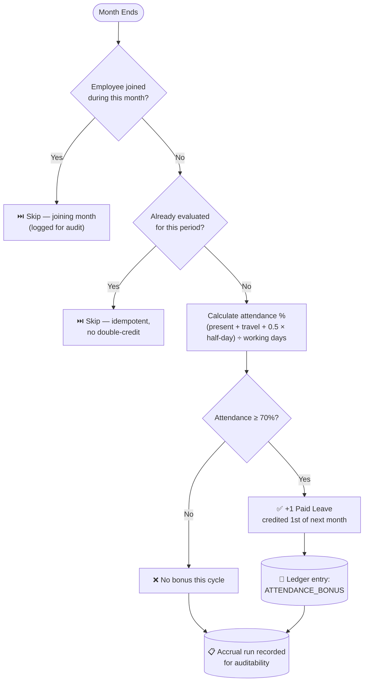
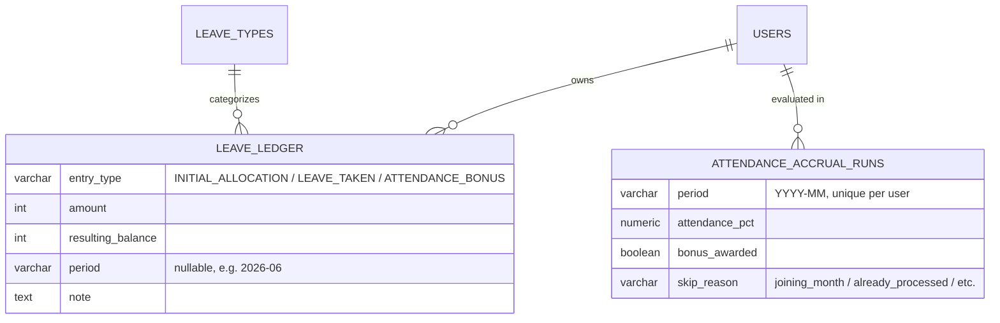
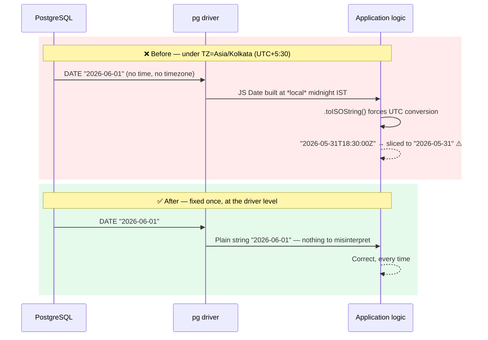

# Ergo Employee Management System (HRMS)

An enterprise-ready, auditable Employee Salary, Leave & Daily Attendance Management System built with Node.js, Express, PostgreSQL, and React + Vite.

---

## 🌟 Key Highlights & Business Capabilities

- **🔐 Strict Role-Based Access Control (RBAC)**: Distinct permissions for `admin` and `employee`. First-login forced password change, bcrypt work-factor 12, and JWT authentication with session expiration handling.
- **⏱️ Daily Attendance System**: Mandatory blocking check-in prompt on working days, supporting `Present` (100%), `Half-Day` (50%), `On Duty / Travel` (100%), and `Absent` (0%). Strict 11:59 PM IST cutoff with employee correction requests and audited admin overrides.
- **🏖️ Leave Management Workflow**: Annual reset leave balances (`Casual Leave: 12d`, `Sick Leave: 6d`, `Paid Leave: 15d`, `Unpaid Leave: 0d`). Automatic exclusion of weekends (Sat/Sun) and company holidays. Same-day leave 9:00 AM IST cutoff, overlap blocking, and transactional balance deductions on approval.
- **🧮 Deterministic Salary Computation Engine**: Per-day rate calculation evaluating actual attendance, approved leaves, and company holidays. Mid-month historical salary rate revisions are automatically resolved day-by-day.
- **📄 Official PDF Payslips & Consolidated Excel Reports**: One-click immutable payslip generation with vector PDF downloads (`pdfkit`) and styled company-wide payroll exports (`exceljs`).
- **🕒 Asia/Kolkata (IST) Timezone Enforcement**: Every date check, attendance cutoff, and holiday evaluation strictly runs in `Asia/Kolkata`.
- **🎛️ "Ops Console" UI**: Attendance treated as infrastructure monitoring — monospace type throughout, one amber accent color, and green/red reserved strictly for pass/fail state (present/absent, active/inactive, approved/declined). Dark/light theme toggle in every header, built entirely on CSS custom properties (`frontend/src/index.css`), with a live-polling activity feed and a real-time IST clock on the Admin Overview screen.

---

## 🆕 Sprint 2 Updates — 12 Aug 2026

Four things landed this sprint: a brand-new payroll-adjacent feature, a fuller employee profile, a critical correctness fix in the calculation engine, and a hardening pass across the codebase. Here's the story of each.


### 1. 🎯 Attendance-Based Leave Accrual Engine

The headline feature. Every employee now **automatically earns bonus paid leave** for consistent attendance — evaluated independently, month after month, with a fully auditable trail of *why* a balance is what it is.

**The rule:** at the end of every month, if an employee's attendance was **≥ 70%**, they earn **+1 paid leave**, credited on the 1st of the following month. Leaves taken and bonuses earned are two independent adjustments to the same running balance.



**Worked example — the balance nets out correctly, every time:**

| Scenario | Leaves Taken | Attendance | Bonus? | Balance |
|---|:---:|:---:|:---:|:---:|
| Perfect month | 0 | 100% | ✅ +1 | 6 → **7** |
| One day off, still qualifies | 1 | 95% | ✅ +1 | 6 → 5 → **6** (nets out) |
| Attendance dips | 0 | 45% | ❌ | 6 → **6** (unchanged) |
| 3 qualifying months in a row | 0 each | ≥70% each | ✅ each | 6 → 7 → 8 → **9** |

**The data model** — a proper ledger, not just a mutable number:



**What's included:**
- Idempotent daily scheduler (`node-cron`, 1 AM IST) with a startup catch-up run — safe to re-run, self-heals if the server was down
- Admin **manual trigger** (`POST /api/leaves/accrual/run`) for backfill/reprocessing any month, reusing the exact same logic as the scheduled job
- Full ledger visible in the **Employee Dashboard** ("Leave Balance History") and the **Admin Leave Requests** page (per-employee ledger + a month-picker to run/re-run accrual)
- Year-end carry-forward: unused balance rolls into the new year on top of a fresh base allocation

### 2. 🧾 Expanded Employee Onboarding

The "Onboard New Employee" form now captures a complete profile — **Gender, Date of Birth, Address, Bank Name, Bank Account No., IFSC Code, Emergency Contact Name & Phone** — with the per-day salary field moved out to the dedicated Salary Rates screen where it belongs. Name and phone-type fields are now validated live (letters-only / digits-only) on both the browser and the API.

### 3. 🐛 Critical Fix: A Silent One-Day Date Shift

While stress-testing the new accrual engine with real attendance data, an employee marked "present" on every single working day showed only **77% attendance instead of 100%**. The root cause turned out to be much bigger than the new feature:



Every `DATE` column read from Postgres — attendance dates, holiday dates, leave ranges, `date_of_joining` — was silently landing on the wrong calendar day whenever matched against another date. That logic sits at the heart of **payroll calculation**, not just the new feature, so this had likely been subtly under- or over-paying attendance-linked salary components for a while. Fixed with a single line at the `pg` driver level (`db/pool.js`), correcting all 13 affected call sites at once — with a regression test guarding against it ever coming back.

### 4. 🔒 Hardening

- A stale login session (e.g. a deleted/deactivated account) used to leak a raw PostgreSQL error straight into the UI. Now translated into a clean, actionable "please log in again."
- Fixed the Salary Rates page's tab navigation, which was rendering with no styling at all.

### ✅ Quality Bar

Both the **Salary** and **Attendance** modules were independently re-audited end-to-end after these changes — live functional tests through the real API (mixed attendance types, mid-month rate revisions, the full correction workflow, RBAC boundaries) confirmed every number and every permission check comes out correct. See the [Automated Testing](#-automated-testing--production-build) section below.

## 🚀 Sprint 3 Updates — 16 Aug 2026

Sprint 3 focused on making the leave engine completely dynamic, fixing edge cases in balance tracking, and certifying the codebase as production-ready with zero hardcoded data.

### 1. ⚙️ Dynamic Earned Leave Target
The attendance bonus engine is no longer hardcoded to credit "Paid Leave". Admins can now designate **any active leave type** as the "Earned Leave" target. 
- Introduced a new `is_earned_leave` boolean flag on the `leave_types` table (Migration `015`).
- The `node-cron` scheduled accrual job dynamically queries this flag to know where to deposit the monthly attendance bonus.
- The UI exposes a simple toggle for the admin on the Leave Types configuration page to swap the target instantly.

### 2. 🔄 Cascading Quota Updates & Ledger Integrity
Fixed a critical bug where changing a leave type's base quota didn't retroactively apply to existing employees' balances.
- The backend now actively computes the delta when an admin updates a `yearly_quota` and cascades that difference across all active `leave_balances` for the current year.
- A one-time database migration script cleaned up orphaned `INITIAL_ALLOCATION` ledger entries for deactivated leave types.
- The employee dashboard ledger query now automatically filters out inactive leave types unless there is genuine historical usage, keeping the UI perfectly clean.

### 3. 🛡️ Industry-Level Codebase Certification
Completed a comprehensive end-to-end audit of the entire frontend and backend to guarantee zero static data:
- **No Mock Arrays**: Every list, dropdown, and dashboard KPI is strictly database-driven via secure API endpoints.
- **No Hardcoded Employees**: Removed all assumptions about user names or dummy emails. All data relies purely on real PostgreSQL state.
- **Secure Configuration**: Validated that all secrets (JWT keys, DB passwords, Mailer configs) are safely bound to `process.env`.

---

## 🖥️ UI Redesign — 15 Aug 2026: "Ops Console"

The entire frontend (admin + employee, all screens, both themes) was re-skinned to a single new visual direction — picked from a five-option mockup gallery (`ergo-ui-directions.html`, kept at the repo root as a reference, not part of the build).

**The idea:** attendance is infrastructure, so the UI should read like one — monospace type everywhere, one amber "phosphor" accent for brand and interactive elements, and green/red used *only* to signal genuine state (present vs. absent, active vs. inactive, approved vs. declined) — never decoratively.

What's real, not decorative:
- The Admin Overview page's **Live Feed** panel polls the existing attendance and leave-request endpoints on an interval and appends genuinely new events as they happen — no fake data.
- The header clock is a real ticking `Asia/Kolkata` clock, not a static timestamp.

Everything is driven by CSS custom properties in `frontend/src/index.css`, so the whole app re-skins from one file — no page hardcodes a color, border, or shadow. See `AGENTS.md` for the full token/contract details if you're extending it.

---

## 🏗️ Architecture & Technology Stack

| Layer | Technologies / Libraries |
|---|---|
| **Frontend** | React 18, Vite, React Router 6, Axios, `lucide-react` icons, Vanilla CSS Design System with dark/light theming |
| **Backend** | Node.js (>=18), Express, Helmet, CORS, Express-Validator, Express-Rate-Limit |
| **Database** | PostgreSQL (>=14), `pg` connection pool, SQL migration runner |
| **Security & Auth** | JWT (`jsonwebtoken`), `bcryptjs`, Rate Limiting, HTTP security headers |
| **Document Generation** | `pdfkit` (PDF Payslips), `exceljs` (Excel Payroll Workbooks) |
| **Testing** | Jest, Supertest (147 automated test cases passing) |
| **Scheduling** | `node-cron` (monthly leave accrual, idempotent daily job) |

---

## 📁 Repository Structure

```
employee_managment_system/
├── backend/
│   ├── api/
│   │   └── index.js          # Vercel serverless entry point (exports app.js, no .listen())
│   ├── vercel.json           # Rewrites + Cron config for Vercel deployment
│   ├── src/
│   │   ├── __tests__/        # Automated test suites (auth, users, attendance, leaves, salary)
│   │   ├── controllers/      # API controller handlers
│   │   ├── db/
│   │   │   ├── migrations/   # Sequential SQL migrations (001 to 010)
│   │   │   ├── migrate.js    # Migration runner
│   │   │   ├── pool.js       # PostgreSQL connection pool with health check
│   │   │   └── seed.js       # Database seeder (Initial Admin)
│   │   ├── jobs/              # Scheduled jobs (monthly leave accrual)
│   │   ├── middleware/       # JWT Auth, RBAC, Error Handler
│   │   ├── routes/           # Express router endpoints
│   │   ├── services/         # Salary engine, leave accrual engine, PDF/Excel report generators
│   │   ├── utils/            # IST time utilities, token signing, ID generation
│   │   ├── app.js            # Express app configuration
│   │   └── server.js         # HTTP server entry point
│   ├── .env.example          # Safe environment variables template
│   └── package.json
│
├── frontend/
│   ├── src/
│   │   ├── api/              # Axios API clients
│   │   ├── components/       # Layouts, Modal, Toast, Theme Toggle
│   │   ├── context/          # Auth & Theme context, session management
│   │   ├── pages/            # Admin & Employee portal pages
│   │   ├── routes/           # Protected routes & App router
│   │   ├── index.css         # Global design tokens and utilities
│   │   └── main.jsx          # React app entry point
│   ├── .env.example
│   └── package.json
└── README.md
```

---

## 🚀 Local Development Setup

### 1. Prerequisites
- **Node.js**: >= 18.0.0
- **PostgreSQL**: >= 14.0.0

---

### 2. Backend Setup

```bash
cd backend

# Install dependencies
npm install

# Configure environment variables
cp .env.example .env
# Edit .env with your local PostgreSQL credentials

# Run database migrations
npm run migrate

# Seed initial admin account
npm run seed

# Start development server
npm run dev
```

---

### 3. Frontend Setup

```bash
cd frontend

# Install dependencies
npm install

# Start development server
npm run dev
```

- **Frontend URL**: `http://localhost:5173`
- **Backend API URL**: `http://localhost:5000`

---

## 🔑 Initial Admin Credentials

After running `npm run seed`:

| Field | Value |
|---|---|
| **Employee ID** | `ADMIN001` |
| **Email** | `admin@ergo.com` |
| **Password** | `Admin@1234` |

*(On first login, you will be prompted to set a permanent, secure password).*

---

## 🧪 Automated Testing & Production Build

### Running Backend Tests
```bash
cd backend
npm test
```
*Result: 147/147 tests pass across 9 suites (`auth`, `users`, `phase2`, `attendance`, `leaves`, `salary`, `leaveAccrual`, `errorHandler`, `datePool`).*

### Building Frontend Production Bundle
```bash
cd frontend
npm run build
```
*Result: Clean compilation into `dist/` with 0 errors.*

---

## ⚙️ Environment Variables Reference

### Backend (`backend/.env`)

| Variable | Required | Description |
|---|---|---|
| `PORT` | Yes | API server port (default: `5000`) |
| `TZ` | Yes | Must be `Asia/Kolkata` |
| `DATABASE_URL` | Vercel only | Single Postgres connection string — takes priority over the five `DB_*` vars below when set (`db/pool.js`). What Vercel Marketplace Postgres integrations (Neon, etc.) inject automatically. |
| `DB_HOST` | Local dev | PostgreSQL server host (`localhost`) — ignored when `DATABASE_URL` is set |
| `DB_PORT` | Local dev | PostgreSQL port (`5432`) — ignored when `DATABASE_URL` is set |
| `DB_NAME` | Local dev | Database name (`ergo_employee_management`) — ignored when `DATABASE_URL` is set |
| `DB_USER` | Local dev | Database user (`postgres`) — ignored when `DATABASE_URL` is set |
| `DB_PASSWORD` | Local dev | Database password — ignored when `DATABASE_URL` is set |
| `DB_MAX_CLIENTS` | No | Pool size cap. Default `20` (fine for one always-on process); on Vercel, size against your Postgres plan's connection limit and real traffic — see "Vercel Deployment" below. |
| `JWT_SECRET` | Yes | Cryptographic secret for signing JWT tokens (min 32 chars) |
| `JWT_EXPIRES_IN` | Yes | Token expiration duration (default: `8h`) |
| `BCRYPT_SALT_ROUNDS` | Yes | Work factor for password hashing (default: `12`) |
| `FRONTEND_URL` | Yes | Permitted CORS frontend origin (`http://localhost:5173`) |
| `CRON_SECRET` | Vercel only | Bearer secret guarding `POST /api/cron/leave-accrual`. Not needed off Vercel. |

---

## 🌐 Production Deployment Readiness

When deploying to a traditional always-on server (e.g. AWS EC2, DigitalOcean, Render, a VPS):

1. **Database Provisioning**:
   - Create a PostgreSQL database instance.
   - Run `npm run migrate` to apply all migrations sequentially.
   - Run `npm run seed` once to create the root Administrator.
2. **Environment Variables**:
   - Provide high-entropy `JWT_SECRET` (`openssl rand -hex 32`).
   - Set `NODE_ENV=production`.
   - Set `FRONTEND_URL=https://your-domain.com`.
3. **Health Check Endpoints**:
   - Basic liveness: `GET /api/health`
   - Database readiness & latency check: `GET /api/db-health`
4. **HTTPS & Security**:
   - Ensure an SSL/TLS reverse proxy (e.g., Nginx, Caddy, Cloudflare) handles HTTPS termination.
   - Set cookie/token transport over secure headers.

This path runs `node src/server.js` as one long-lived process — `npm start` — which holds the in-process `node-cron` scheduler (`src/jobs/leaveAccrualJob.js`) and a normal `pg.Pool`. Not what the sections below use.

---

## ▲ Vercel Deployment

The backend deploys as a serverless function, not a long-lived process — a few things behave differently from the traditional path above, so this section calls them out explicitly rather than leaving them implicit.

### Sizing: this is calibrated for ~500-1000 employees at one company

Not a 10-person demo. That changes two things concretely, both covered below:

- **Vercel plan**: Hobby (free) is licensed for personal/non-commercial use and caps bandwidth and function invocations in ways that won't hold at this headcount — use **Pro** at minimum.
- **Neon (or equivalent) plan**: the free tier auto-suspends its compute after inactivity (cold-start delay on the next request) and caps concurrent connections tightly. A real workforce this size — especially the daily attendance-marking rush around shift start — needs a paid tier with dedicated/autoscaling compute and a higher connection ceiling. Check Neon's current connection limits per plan against the `DB_MAX_CLIENTS` guidance below before committing to a tier.
- Single-tenant: this is one company's own deployment, not a multi-client SaaS product. If that ever changes, the schema has no tenant-isolation boundary today and would need real changes before onboarding a second company — don't assume this scales to that without revisiting it first.

### What's different in serverless

| Concern | Traditional server | On Vercel |
|---|---|---|
| Entry point | `src/server.js` (`app.listen()`) | `api/index.js` (exports the Express `app`; never calls `.listen()`) |
| Scheduled leave-accrual job | In-process `node-cron`, runs inside the always-on process | **Vercel Cron** hits `POST /api/cron/leave-accrual` on a schedule (config in `vercel.json`) |
| DB connections | One process, one pool — `DB_MAX_CLIENTS` can stay generous | Every function instance opens its own pool; **must** point at a pooled DB endpoint and cap `DB_MAX_CLIENTS` |
| HTTPS | Your reverse proxy's job | Automatic — Vercel terminates TLS for every deployment, nothing to configure |
| `trust proxy` | Set to match your proxy's hop count | Already correct as `1` (`app.js`) — Vercel's edge is exactly one hop in front of the function |
| `NODE_ENV` | You set it | Vercel sets `NODE_ENV=production` automatically for production deployments |

### Setup steps

1. **Database — provision a serverless-friendly Postgres, on a paid tier** (see sizing note above).
   [Neon](https://vercel.com/marketplace) is the natural fit (Vercel Marketplace: `vercel integration add neon`, or the dashboard) — it auto-provisions and injects a single `DATABASE_URL` connection string into the linked project. **`db/pool.js` reads `DATABASE_URL` directly when it's set** (SSL included) — no manual splitting into `DB_HOST`/`DB_PORT`/etc. required, that's only the local-dev fallback. Neon gives you two forms of it:
   - A **pooled** connection string (hostname contains `-pooler`, PgBouncer-backed) — this is what `DATABASE_URL` should point at for the running app. This app talks to Postgres with plain `pg.Pool` (not `@neondatabase/serverless`), so the fix for "many function instances, each with their own pool" is the pooler doing connection multiplexing on the DB side, not a driver swap.
   - A **direct** (non-pooled) connection string — only needed for `npm run migrate` (see step 3), not for the app itself.

   Any other managed Postgres with a pooled/PgBouncer connection mode works the same way — Neon is just the path with a one-click Vercel Marketplace integration.

2. **Environment variables** — set these in the Vercel dashboard (`Project → Settings → Environment Variables`), scoped to Production (and Preview if you want preview deployments hitting a real DB):
   - Everything in the table above, plus `JWT_SECRET`, `OTP_PEPPER`, `BCRYPT_SALT_ROUNDS`, SMTP vars — same requirements as the traditional path.
   - `DATABASE_URL` from Neon's **pooled** connection string — Vercel's Neon Marketplace integration sets this automatically; confirm it's the pooled form, not direct.
   - `DB_MAX_CLIENTS` — start around `10` and adjust from Neon's dashboard connection metrics under real load, not a guess made in advance. Too low throttles legitimate concurrent traffic (e.g. shift-start attendance marking); too high risks connection exhaustion during that same rush. Vercel's Fluid Compute (default) reuses warm instances across concurrent requests rather than spinning up one instance per request, which helps here, but doesn't eliminate the need for a real ceiling.
   - `CRON_SECRET` — `openssl rand -hex 32`. Used only by the cron endpoint below.
   - `FRONTEND_URL` — wherever the frontend ends up (its own Vercel project or elsewhere).
   - Locally, `vercel env pull .env.local --yes` pulls whatever's configured on Vercel into a gitignored file for local testing against the same values.

3. **Run migrations against the production database before the first deploy** (and after every deploy that adds one). Vercel doesn't run this automatically:
   ```bash
   vercel env pull .env.production.local --environment=production --yes
   # Swap in Neon's *direct* (non-pooled) connection string for DATABASE_URL
   # in .env.production.local before running this — a schema migration
   # holding a lock behaves better on a direct connection than a pooled one.
   npm run migrate
   ```

4. **Link and deploy**:
   ```bash
   vercel link --yes --project ergo-backend   # first time only
   vercel --prod
   ```
   Or connect the GitHub repo in the Vercel dashboard for git-push deploys — every push to a non-production branch gets a preview URL automatically, pushes to `main` (or whichever branch is configured as Production) deploy to production. This is independent of the GitHub Actions CI added in Phase 1 (`.github/workflows/ci.yml`); that workflow gates code quality via required-check branch protection, Vercel's git integration handles the actual deploy.

5. **Scheduled job — verify Vercel Cron fired.** `vercel.json` schedules `POST /api/cron/leave-accrual` at `30 19 * * *`. **Vercel Cron always runs in UTC** (no per-job timezone setting, unlike the `node-cron` version this replaces) — `19:30 UTC` = `01:00 IST` the next calendar day, matching the original job's intent. The job is idempotent (safe to trigger more than once for the same period) and evaluates "the most recently completed period" rather than "exactly today," so a missed or delayed tick self-heals on the next run. Check `Vercel Dashboard → Project → Cron Jobs` for run history, or `vercel logs` for the `[leave-accrual] cron: ...` line.

6. **Health checks + uptime monitoring.** `GET /api/health` and `GET /api/db-health` (both already exist) work unchanged on Vercel. Vercel's own dashboard shows deployment/function status but isn't an uptime monitor — point an external one (UptimeRobot, Better Uptime, Checkly, etc.) at `/api/health` if you want alerting on the API actually being reachable, not just "the last deploy succeeded."

7. **Rate limits are sized for this headcount already, but re-check them once real traffic patterns are known.** The per-IP limiters in `authRoutes.js` and `reportRoutes.js` assume a large office can share one outbound IP (login, employee password-reset requests, report/payslip downloads all scale their ceilings accordingly) — the per-*account* 5-attempt login lockout is what actually carries the anti-brute-force weight, not these IP ceilings. If employees mostly connect from home/mobile instead of one office network, these could safely be tightened back down; if usage patterns turn out spikier than expected, they may need to go higher still.

---

## 💾 Database Backup & Restore

Applies regardless of host — standard `pg_dump`/`pg_restore`, plus Neon's built-in option if that's where the database ends up.

### Manual backup

```bash
# Full backup, compressed custom format (best for pg_restore)
pg_dump --format=custom --file=ergo_backup_$(date +%Y%m%d).dump \
  "postgresql://<user>:<password>@<host>:<port>/<database>"
```
Use the connection string from `.env` / `.env.production.local`. Store the resulting `.dump` file somewhere outside the app repo — a private S3/Blob bucket, not git.

### Restore

```bash
# Into a fresh/empty database
pg_restore --clean --if-exists --no-owner \
  --dbname="postgresql://<user>:<password>@<host>:<port>/<database>" \
  ergo_backup_YYYYMMDD.dump
```
`--clean --if-exists` drops existing objects first so a restore onto a non-empty database doesn't collide; `--no-owner` avoids failures when the restoring role doesn't match the original dump's owner (common when restoring into a different environment).

### Restore drill — do this at least once, before you need it for real

1. Take a backup of a non-production database (or a fresh copy of production data) with the command above.
2. Provision a throwaway Postgres database (a second Neon branch is the fastest way — see below).
3. Restore into it and run `npm test` / a manual login+dashboard check against that restored database's connection string.
4. Confirm row counts on a couple of key tables (`users`, `attendance`, `payslips`) roughly match what you expect.
5. Delete the throwaway database.

If step 3 fails, that's the actual finding — better discovered during a drill than during a real incident.

### If using Neon specifically

Neon's branching feature (`Console → Branches → Create Branch`, or `neonctl branches create --parent main`) creates a copy-on-write clone of the database in seconds — useful both as a faster restore-drill substrate than steps 2-3 above, and as Neon's own point-in-time recovery mechanism (branch from any timestamp in the retention window) as an alternative to restoring a `pg_dump` file for a real incident. Confirm your plan's retention window (how far back you can branch from) matches how much data loss you're willing to tolerate.

### Encryption at rest

Not something to assume — confirm explicitly with whichever provider ends up hosting the database (Neon encrypts data at rest by default on their managed infrastructure; verify this holds for whatever plan/region gets selected, since guarantees can vary by tier).

---

## 🛠️ Maintenance Log

- 2026-08-17: Full functional test pass across all modules (admin + employee flows).
- 2026-08-17: Backend Jest suite verified — 184/184 tests passing.
- 2026-08-17: Fixed `/api/auth/login` to return full profile fields (phone, designation, date of joining, gender, bank name).
- 2026-08-17: Fixed the salary form's Gross Income summary to fall back to Monthly Salary when the itemized breakdown is blank.
- 2026-08-17: Admin Employees module verified — create, view, edit, deactivate/reactivate, search.
- 2026-08-17: Leave Types and Leave Requests modules verified — approve/decline flows, balance ledger.
- 2026-08-17: Attendance module verified — manual override, correction-request submit/approve.
- 2026-08-17: Salary module verified — rate updates, revision audit log, monthly payroll preview.
- 2026-08-17: Holidays and Reports modules verified — CRUD, consolidated payroll view.
- 2026-08-17: Password Resets flow verified end-to-end — employee request → admin temp password → forced change.
- 2026-08-17: Employee-side dashboard, leave application, and check-in flows verified.
- 2026-08-17: QA pass closed out — 2 confirmed bugs fixed and verified, all 184 backend tests green.
- 2026-08-20: Security hardening Phase 0 — trust proxy, CSP, download rate limiting, strong temp-password generation.
- 2026-08-20: Security hardening Phase 1 — audit logging on sensitive admin actions, per-account login lockout, GitHub Actions CI, frontend ESLint.
- 2026-08-20: Security hardening Phase 2 — token-storage decision documented (kept `localStorage`); Vercel deployment path added (`api/index.js`, `vercel.json`, Vercel Cron for leave accrual, serverless-safe DB pooling); DB backup/restore drill documented. 193/193 backend tests green.
- 2026-08-20: Unified password-change security posture across every endpoint — `POST /api/auth/reset-password` was silently skipping `password_changed_at` (the field that revokes other sessions on a password change), the reuse check, and audit logging that the other two flows already had. 194/194 backend tests green.
- 2026-08-20: `db/pool.js` now accepts a single `DATABASE_URL` (what every Vercel Postgres Marketplace integration actually injects) instead of requiring it be split into 5 separate vars — fixes a real deployment blocker. Deployment sizing recalibrated in this README for a ~500-1000 employee single-company rollout (Vercel Pro + paid Postgres tier, not Hobby/free; per-IP rate-limit ceilings widened for a large office sharing one outbound IP, since the per-account lockout — not the IP ceiling — is what actually stops brute-forcing).
