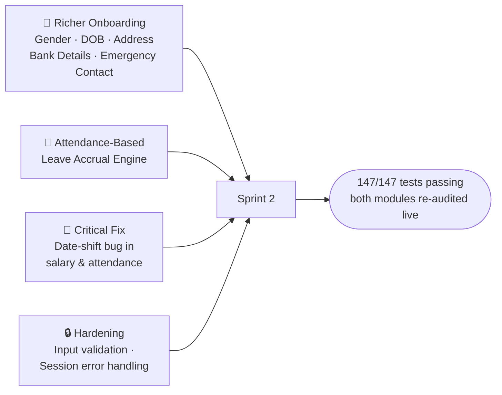
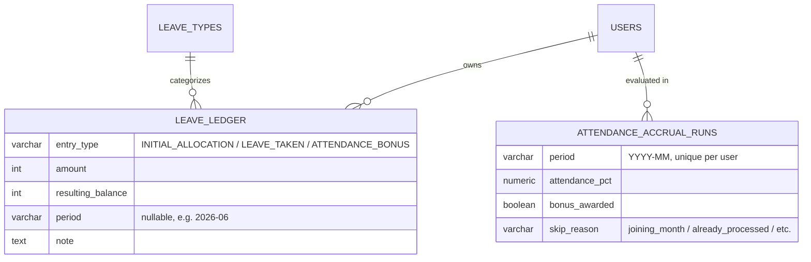
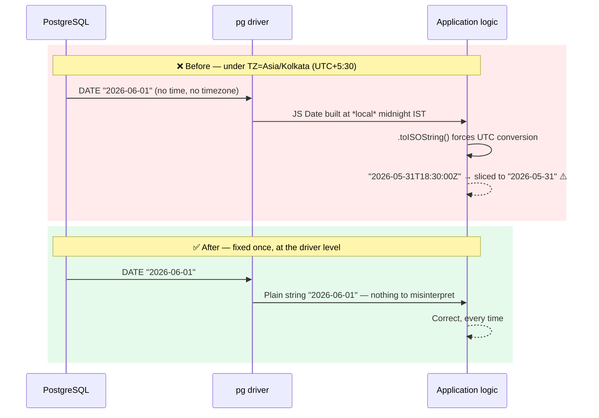

# Ergo Employee Management System (HRMS)

An enterprise-ready, auditable Employee Salary, Leave & Daily Attendance Management System built with Node.js, Express, PostgreSQL, and React + Vite.

---

## 🌟 Key Highlights & Business Capabilities

- **🔐 Strict Role-Based Access Control (RBAC)**: Distinct permissions for `admin` and `employee`. First-login forced password change, bcrypt work-factor 12, and JWT authentication with session expiration handling.
- **⏱️ Daily Attendance System**: Mandatory blocking check-in prompt on working days, supporting `Present` (100%), `Half-Day` (50%), `On Duty / Travel` (100%), and `Absent` (0%). Strict 11:59 PM IST cutoff with employee correction requests and audited admin overrides.
- **🏖️ Leave Management Workflow**: Annual reset leave balances (`Casual Leave: 12d`, `Sick Leave: 6d`, `Paid Leave: 15d`, `Unpaid Leave: 0d`). Automatic exclusion of weekends (Sat/Sun) and company holidays. Same-day leave 9:00 AM IST cutoff, overlap blocking, and transactional balance deductions on approval.
- **🧮 Deterministic Salary Computation Engine**: Per-day rate calculation evaluating actual attendance, approved leaves, and company holidays. Mid-month historical salary rate revisions are automatically resolved day-by-day.
- **📄 Official PDF Payslips & Consolidated Excel Reports**: One-click immutable payslip generation with vector PDF downloads (`pdfkit`) and styled company-wide payroll exports (`exceljs`).
- **🕒 Asia/Kolkata (IST) Timezone Enforcement**: Every date check, attendance cutoff, and holiday evaluation strictly runs in `Asia/Kolkata`.
- **🎛️ "Ops Console" UI**: Attendance treated as infrastructure monitoring — monospace type throughout, one amber accent color, and green/red reserved strictly for pass/fail state (present/absent, active/inactive, approved/declined). Dark/light theme toggle in every header, built entirely on CSS custom properties (`frontend/src/index.css`), with a live-polling activity feed and a real-time IST clock on the Admin Overview screen.

---

## 🆕 Sprint 2 Updates — 12 Aug 2026

Four things landed this sprint: a brand-new payroll-adjacent feature, a fuller employee profile, a critical correctness fix in the calculation engine, and a hardening pass across the codebase. Here's the story of each.



### 1. 🎯 Attendance-Based Leave Accrual Engine

The headline feature. Every employee now **automatically earns bonus paid leave** for consistent attendance — evaluated independently, month after month, with a fully auditable trail of *why* a balance is what it is.

**The rule:** at the end of every month, if an employee's attendance was **≥ 70%**, they earn **+1 paid leave**, credited on the 1st of the following month. Leaves taken and bonuses earned are two independent adjustments to the same running balance.


**Worked example — the balance nets out correctly, every time:**

| Scenario | Leaves Taken | Attendance | Bonus? | Balance |
|---|:---:|:---:|:---:|:---:|
| Perfect month | 0 | 100% | ✅ +1 | 6 → **7** |
| One day off, still qualifies | 1 | 95% | ✅ +1 | 6 → 5 → **6** (nets out) |
| Attendance dips | 0 | 45% | ❌ | 6 → **6** (unchanged) |
| 3 qualifying months in a row | 0 each | ≥70% each | ✅ each | 6 → 7 → 8 → **9** |

**The data model** — a proper ledger, not just a mutable number:



**What's included:**
- Idempotent daily scheduler (`node-cron`, 1 AM IST) with a startup catch-up run — safe to re-run, self-heals if the server was down
- Admin **manual trigger** (`POST /api/leaves/accrual/run`) for backfill/reprocessing any month, reusing the exact same logic as the scheduled job
- Full ledger visible in the **Employee Dashboard** ("Leave Balance History") and the **Admin Leave Requests** page (per-employee ledger + a month-picker to run/re-run accrual)
- Year-end carry-forward: unused balance rolls into the new year on top of a fresh base allocation

### 2. 🧾 Expanded Employee Onboarding

The "Onboard New Employee" form now captures a complete profile — **Gender, Date of Birth, Address, Bank Name, Bank Account No., IFSC Code, Emergency Contact Name & Phone** — with the per-day salary field moved out to the dedicated Salary Rates screen where it belongs. Name and phone-type fields are now validated live (letters-only / digits-only) on both the browser and the API.

### 3. 🐛 Critical Fix: A Silent One-Day Date Shift

While stress-testing the new accrual engine with real attendance data, an employee marked "present" on every single working day showed only **77% attendance instead of 100%**. The root cause turned out to be much bigger than the new feature:



Every `DATE` column read from Postgres — attendance dates, holiday dates, leave ranges, `date_of_joining` — was silently landing on the wrong calendar day whenever matched against another date. That logic sits at the heart of **payroll calculation**, not just the new feature, so this had likely been subtly under- or over-paying attendance-linked salary components for a while. Fixed with a single line at the `pg` driver level (`db/pool.js`), correcting all 13 affected call sites at once — with a regression test guarding against it ever coming back.

### 4. 🔒 Hardening

- A stale login session (e.g. a deleted/deactivated account) used to leak a raw PostgreSQL error straight into the UI. Now translated into a clean, actionable "please log in again."
- Fixed the Salary Rates page's tab navigation, which was rendering with no styling at all.

### ✅ Quality Bar

Both the **Salary** and **Attendance** modules were independently re-audited end-to-end after these changes — live functional tests through the real API (mixed attendance types, mid-month rate revisions, the full correction workflow, RBAC boundaries) confirmed every number and every permission check comes out correct. See the [Automated Testing](#-automated-testing--production-build) section below.

## 🚀 Sprint 3 Updates — 16 Aug 2026

Sprint 3 focused on making the leave engine completely dynamic, fixing edge cases in balance tracking, and certifying the codebase as production-ready with zero hardcoded data.

### 1. ⚙️ Dynamic Earned Leave Target
The attendance bonus engine is no longer hardcoded to credit "Paid Leave". Admins can now designate **any active leave type** as the "Earned Leave" target. 
- Introduced a new `is_earned_leave` boolean flag on the `leave_types` table (Migration `015`).
- The `node-cron` scheduled accrual job dynamically queries this flag to know where to deposit the monthly attendance bonus.
- The UI exposes a simple toggle for the admin on the Leave Types configuration page to swap the target instantly.

### 2. 🔄 Cascading Quota Updates & Ledger Integrity
Fixed a critical bug where changing a leave type's base quota didn't retroactively apply to existing employees' balances.
- The backend now actively computes the delta when an admin updates a `yearly_quota` and cascades that difference across all active `leave_balances` for the current year.
- A one-time database migration script cleaned up orphaned `INITIAL_ALLOCATION` ledger entries for deactivated leave types.
- The employee dashboard ledger query now automatically filters out inactive leave types unless there is genuine historical usage, keeping the UI perfectly clean.

### 3. 🛡️ Industry-Level Codebase Certification
Completed a comprehensive end-to-end audit of the entire frontend and backend to guarantee zero static data:
- **No Mock Arrays**: Every list, dropdown, and dashboard KPI is strictly database-driven via secure API endpoints.
- **No Hardcoded Employees**: Removed all assumptions about user names or dummy emails. All data relies purely on real PostgreSQL state.
- **Secure Configuration**: Validated that all secrets (JWT keys, DB passwords, Mailer configs) are safely bound to `process.env`.

---

## 🖥️ UI Redesign — 15 Aug 2026: "Ops Console"

The entire frontend (admin + employee, all screens, both themes) was re-skinned to a single new visual direction — picked from a five-option mockup gallery (`ergo-ui-directions.html`, kept at the repo root as a reference, not part of the build).

**The idea:** attendance is infrastructure, so the UI should read like one — monospace type everywhere, one amber "phosphor" accent for brand and interactive elements, and green/red used *only* to signal genuine state (present vs. absent, active vs. inactive, approved vs. declined) — never decoratively.

What's real, not decorative:
- The Admin Overview page's **Live Feed** panel polls the existing attendance and leave-request endpoints on an interval and appends genuinely new events as they happen — no fake data.
- The header clock is a real ticking `Asia/Kolkata` clock, not a static timestamp.

Everything is driven by CSS custom properties in `frontend/src/index.css`, so the whole app re-skins from one file — no page hardcodes a color, border, or shadow. See `AGENTS.md` for the full token/contract details if you're extending it.

---

## 🏗️ Architecture & Technology Stack

| Layer | Technologies / Libraries |
|---|---|
| **Frontend** | React 18, Vite, React Router 6, Axios, `lucide-react` icons, Vanilla CSS Design System with dark/light theming |
| **Backend** | Node.js (>=18), Express, Helmet, CORS, Express-Validator, Express-Rate-Limit |
| **Database** | PostgreSQL (>=14), `pg` connection pool, SQL migration runner |
| **Security & Auth** | JWT (`jsonwebtoken`), `bcryptjs`, Rate Limiting, HTTP security headers |
| **Document Generation** | `pdfkit` (PDF Payslips), `exceljs` (Excel Payroll Workbooks) |
| **Testing** | Jest, Supertest (147 automated test cases passing) |
| **Scheduling** | `node-cron` (monthly leave accrual, idempotent daily job) |

---

## 📁 Repository Structure

```
employee_managment_system/
├── backend/
│   ├── src/
│   │   ├── __tests__/        # Automated test suites (auth, users, attendance, leaves, salary)
│   │   ├── controllers/      # API controller handlers
│   │   ├── db/
│   │   │   ├── migrations/   # Sequential SQL migrations (001 to 010)
│   │   │   ├── migrate.js    # Migration runner
│   │   │   ├── pool.js       # PostgreSQL connection pool with health check
│   │   │   └── seed.js       # Database seeder (Initial Admin)
│   │   ├── jobs/              # Scheduled jobs (monthly leave accrual)
│   │   ├── middleware/       # JWT Auth, RBAC, Error Handler
│   │   ├── routes/           # Express router endpoints
│   │   ├── services/         # Salary engine, leave accrual engine, PDF/Excel report generators
│   │   ├── utils/            # IST time utilities, token signing, ID generation
│   │   ├── app.js            # Express app configuration
│   │   └── server.js         # HTTP server entry point
│   ├── .env.example          # Safe environment variables template
│   └── package.json
│
├── frontend/
│   ├── src/
│   │   ├── api/              # Axios API clients
│   │   ├── components/       # Layouts, Modal, Toast, Theme Toggle
│   │   ├── context/          # Auth & Theme context, session management
│   │   ├── pages/            # Admin & Employee portal pages
│   │   ├── routes/           # Protected routes & App router
│   │   ├── index.css         # Global design tokens and utilities
│   │   └── main.jsx          # React app entry point
│   ├── .env.example
│   └── package.json
└── README.md
```

---

## 🚀 Local Development Setup

### 1. Prerequisites
- **Node.js**: >= 18.0.0
- **PostgreSQL**: >= 14.0.0

---

### 2. Backend Setup

```bash
cd backend

# Install dependencies
npm install

# Configure environment variables
cp .env.example .env
# Edit .env with your local PostgreSQL credentials

# Run database migrations
npm run migrate

# Seed initial admin account
npm run seed

# Start development server
npm run dev
```

---

### 3. Frontend Setup

```bash
cd frontend

# Install dependencies
npm install

# Start development server
npm run dev
```

- **Frontend URL**: `http://localhost:5173`
- **Backend API URL**: `http://localhost:5000`

---

## 🔑 Initial Admin Credentials

After running `npm run seed`:

| Field | Value |
|---|---|
| **Employee ID** | `ADMIN001` |
| **Email** | `admin@ergo.com` |
| **Password** | `Admin@1234` |

*(On first login, you will be prompted to set a permanent, secure password).*

---

## 🧪 Automated Testing & Production Build

### Running Backend Tests
```bash
cd backend
npm test
```
*Result: 147/147 tests pass across 9 suites (`auth`, `users`, `phase2`, `attendance`, `leaves`, `salary`, `leaveAccrual`, `errorHandler`, `datePool`).*

### Building Frontend Production Bundle
```bash
cd frontend
npm run build
```
*Result: Clean compilation into `dist/` with 0 errors.*

---

## ⚙️ Environment Variables Reference

### Backend (`backend/.env`)

| Variable | Required | Description |
|---|---|---|
| `PORT` | Yes | API server port (default: `5000`) |
| `TZ` | Yes | Must be `Asia/Kolkata` |
| `DB_HOST` | Yes | PostgreSQL server host (`localhost`) |
| `DB_PORT` | Yes | PostgreSQL port (`5432`) |
| `DB_NAME` | Yes | Database name (`ergo_employee_management`) |
| `DB_USER` | Yes | Database user (`postgres`) |
| `DB_PASSWORD` | Yes | Database password |
| `JWT_SECRET` | Yes | Cryptographic secret for signing JWT tokens (min 32 chars) |
| `JWT_EXPIRES_IN` | Yes | Token expiration duration (default: `8h`) |
| `BCRYPT_SALT_ROUNDS` | Yes | Work factor for password hashing (default: `12`) |
| `FRONTEND_URL` | Yes | Permitted CORS frontend origin (`http://localhost:5173`) |

---

## 🌐 Production Deployment Readiness

When deploying to a production server (e.g. AWS EC2, DigitalOcean, Render, Heroku):

1. **Database Provisioning**:
   - Create a PostgreSQL database instance.
   - Run `npm run migrate` to apply all 10 migrations sequentially.
   - Run `npm run seed` once to create the root Administrator.
2. **Environment Variables**:
   - Provide high-entropy `JWT_SECRET` (`openssl rand -hex 32`).
   - Set `NODE_ENV=production`.
   - Set `FRONTEND_URL=https://your-domain.com`.
3. **Health Check Endpoints**:
   - Basic liveness: `GET /api/health`
   - Database readiness & latency check: `GET /api/db-health`
4. **HTTPS & Security**:
   - Ensure an SSL/TLS reverse proxy (e.g., Nginx, Caddy, Cloudflare) handles HTTPS termination.
   - Set cookie/token transport over secure headers.

---

## 🛠️ Maintenance Log

- 2026-08-17: Full functional test pass across all modules (admin + employee flows).
- 2026-08-17: Backend Jest suite verified — 184/184 tests passing.
- 2026-08-17: Fixed `/api/auth/login` to return full profile fields (phone, designation, date of joining, gender, bank name).
- 2026-08-17: Fixed the salary form's Gross Income summary to fall back to Monthly Salary when the itemized breakdown is blank.
